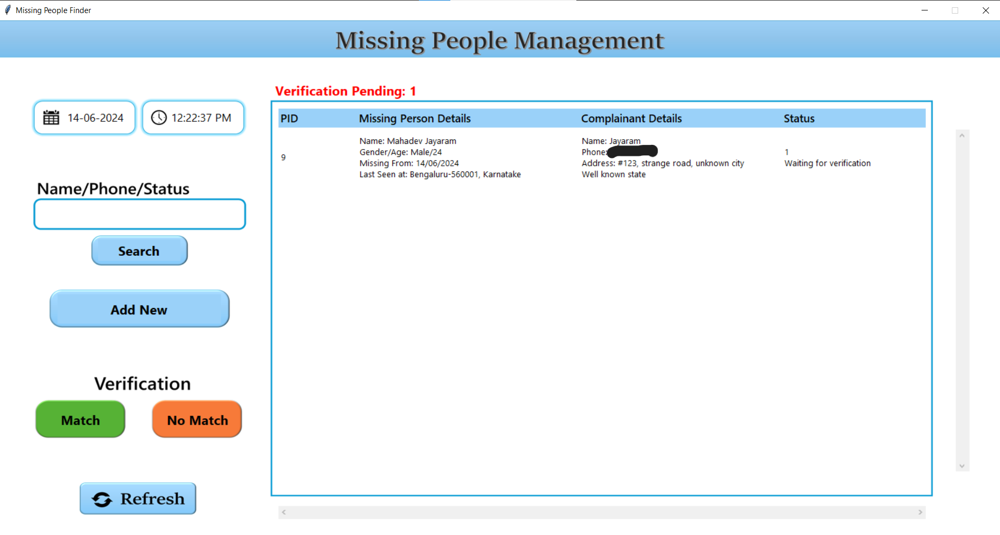
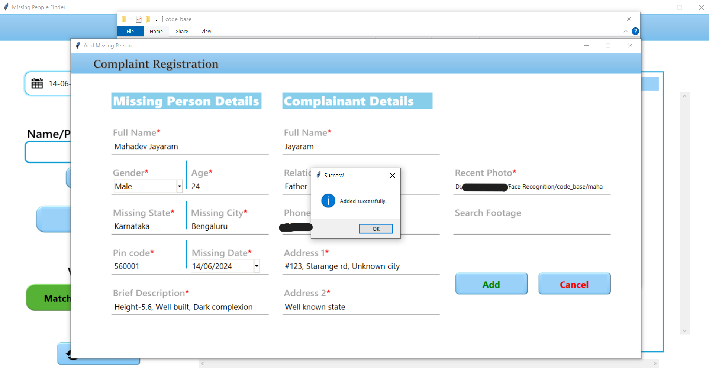
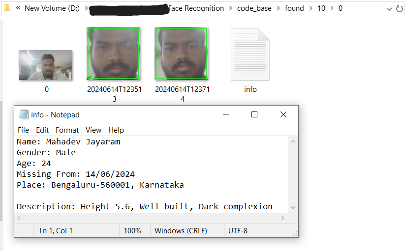
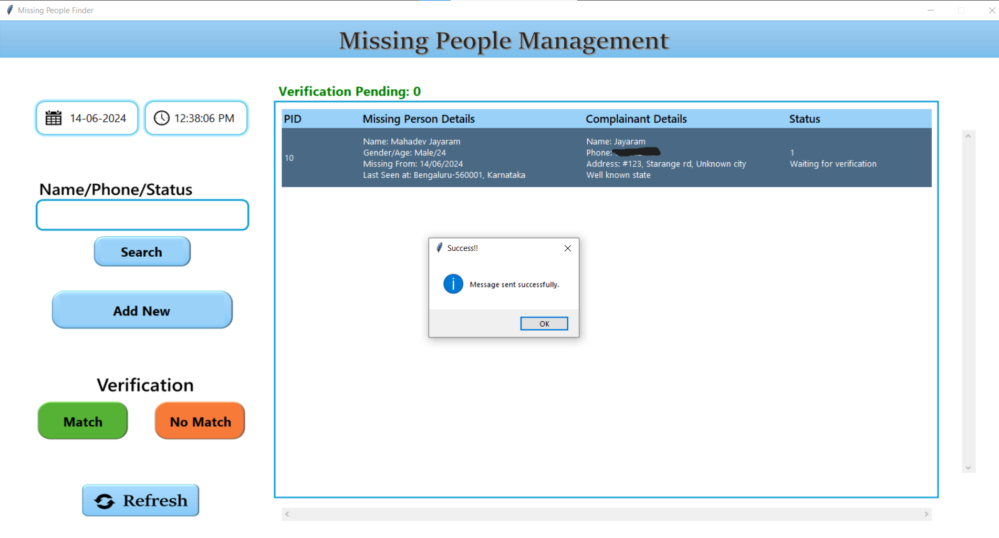
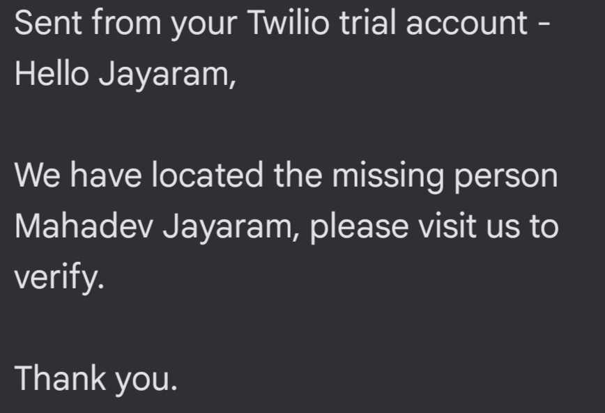

# Missing Person Detection System with DeepFace and SQLite

This project implements a missing person detection system that leverages facial recognition and database interaction. It utilizes the capabilities of the DeepFace library for real-time face detection and recognition, and SQLite for managing missing person information.

## Features

### - Facial Recognition:
DeepFace library for face detection and recognition in video frames or live camera feed.
Command-line configurable facial recognition model (Dlib, VGG-Face, Facenet, etc.) and detector backend (ssd, mtcnn, retinaface, etc.) for optimized performance.

### - Database Management:
SQLite database stores missing person details (names, images, etc.).
Connects to the database for retrieving information during facial recognition.

### - Detection Logic:
Analyzes video frames (or live camera feed) to detect faces using DeepFace.
Compares identified faces against the missing person database for verification.
Configurable "surity level" dictates the number of detections within a timeframe (in seconds) to be considered a verified match.

### - Verification and Reporting:
Upon verified match:
Saves an image of the detected missing person.
Updates a scan_info.json file with details about the detection event (timestamps, image locations).

### - Error Handling and Logging:
Handles potential errors during database interaction, facial recognition, or video processing.
Logs errors to the scan_info.json file for troubleshooting.

## Installation

- Clone the repository
    ```bash
    git clone https://github.com/mahadev0811/MissingPersonDetector.git
    ```

- Install the required packages
    ```bash
    pip install -r requirements.txt
    ```

- Run the application
    ```bash
    python app.py
    ```
    
## Contributing

We welcome contributions to improve this system. Feel free to fork the repository and submit pull requests with your enhancements.\
For major changes, please open an issue first to discuss what you would like to change.
## Screenshots

- A screenshot showcasing the queue of missing persons awaiting verification.


- A screenshot of the interface for registering a new missing person in the database.


- A screenshot of the verification window where potential matches anf thier info are displayed for confirmation.


- A screenshot depicting a verified missing person identification on main screen.


- A mockup SMS notification sent to the complainant through Twilio upon a verified match.



## License

[MIT](https://choosealicense.com/licenses/mit/)

